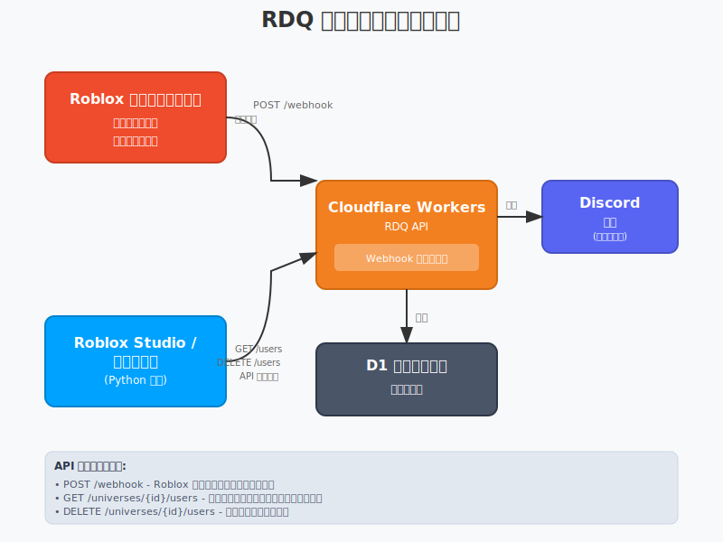
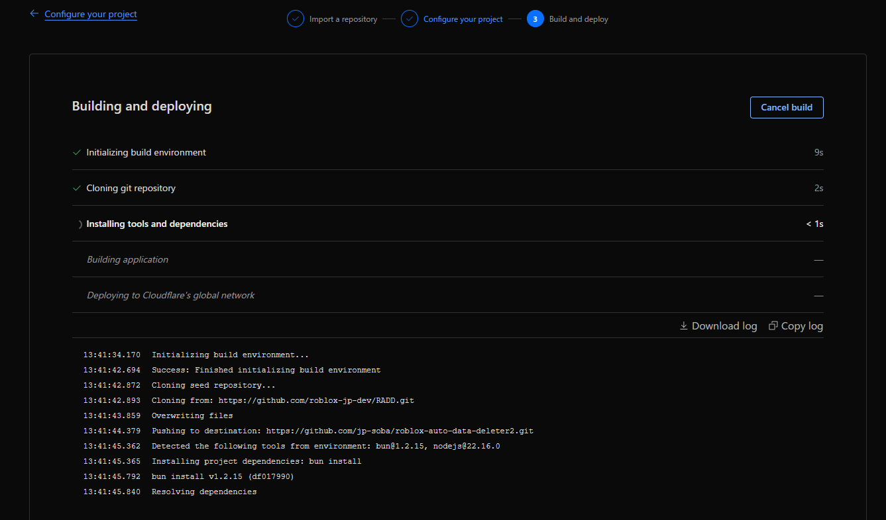
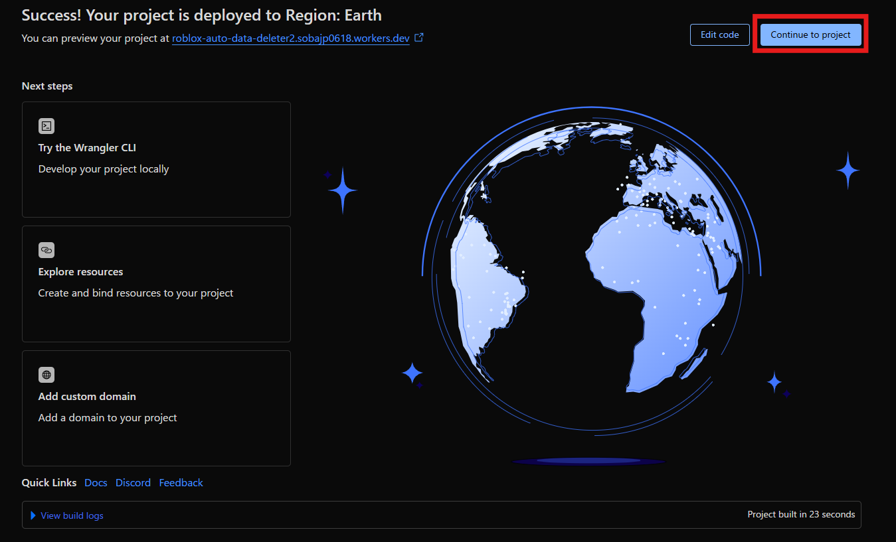
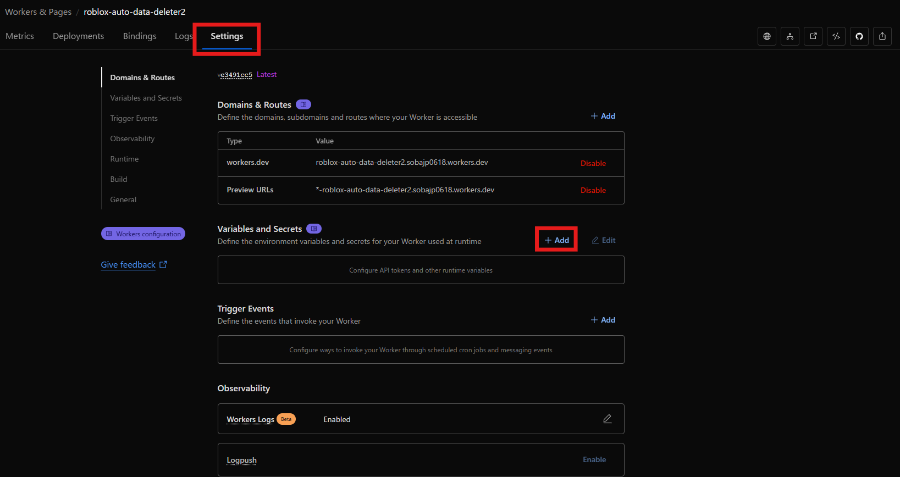
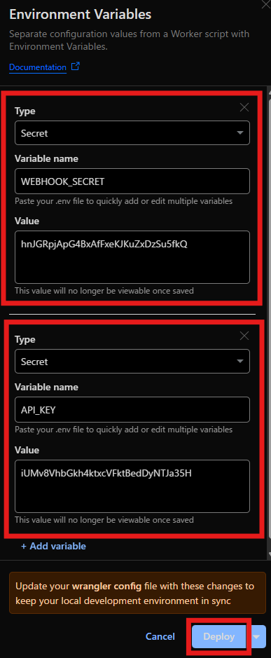
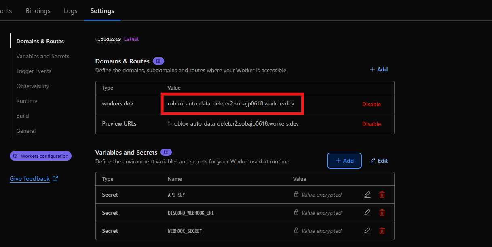
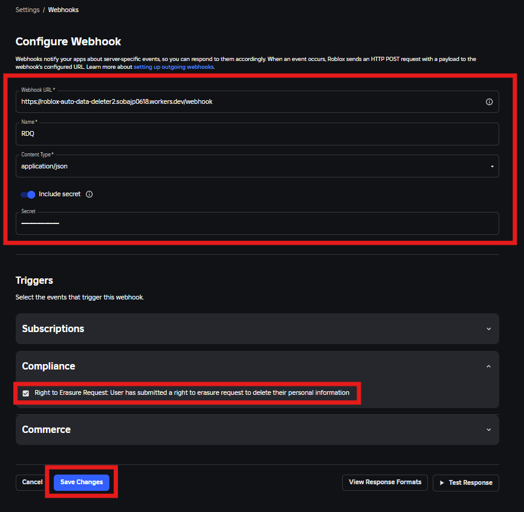
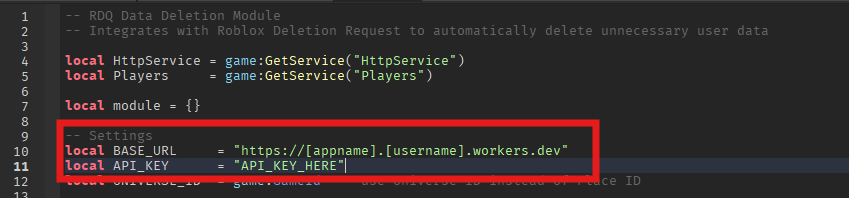

# Roblox Deletion キュー (RDQ)

Cloudflare Workers と D1 を使って Roblox のユーザーデータ削除リクエストを管理する、最小限のサーバーレス API です！

## システムアーキテクチャ



## セットアップ

1. Cloudflare と GitHub にサインアップする

2. 下のボタンをクリック  
<a href="https://deploy.workers.cloudflare.com/?url=https%3A%2F%2Fgithub.com%2Froblox-jp-dev%2FRADD" target="_blank" rel="noopener noreferrer">  
    
</a>

3. Cloudflare のアプリケーション設定画面が開くので、GitHub アカウントを選択し「Create and deploy」をクリックする

4. デプロイが完了するまで待つ  


5. デプロイ完了後、「Continue to project」をクリック  


6. 「Settings」タブ内の「Variables and Secrets」セクションで「Add」をクリック  


7. 環境変数として `API_KEY` と `WEBHOOK_SECRET` を追加する。  
   - 値は長くて安全な英数字の文字列にし、他人と共有しない  
   - 後ほど利用するのでメモを残しておく  
   - 任意で `DISCORD_WEBHOOK_URL` を設定すると Discord へ通知が送れる  


8. アプリケーションのドメインをコピーする（後で使用）  


9. Roblox 側の Webhook 設定を行う。以下ページにアクセス：  
   https://create.roblox.com/settings/webhooks

10. 下図のとおり設定する  
    - **Webhook URL**：`https://<先ほどコピーしたドメイン>/webhook`  
    - **Secret**：手順7で設定した `WEBHOOK_SECRET`  


以上でアプリケーション側のセットアップは完了です。  
以降、Roblox から届いた削除リクエストは Cloudflare 上に保存されます。  
以下の API エンドポイントを使って、未処理のユーザー ID を取得したり、処理済みのユーザー ID データを削除したりできます。

## Roblox Studio からの API 呼び出し例

Python や Datastore API キーを使った呼び出しなども可能ですが、ここでは Roblox 側の例を示します。

1. 以下のアセットを取得する  
   https://create.roblox.com/store/asset/83989452965061/RDQ-sample-script

2. モジュールスクリプト内のこの 2 行を、先ほどの URL と `API_KEY` に書き換える  


3. Sample Script にあるように、モジュールスクリプトの `processDataDeletion` 関数を使ってデータを処理する  
   - 引数に削除用関数を渡すと、削除対象のユーザー ID リストがその関数に渡される  
   - 削除処理が成功した場合は `true` を返すことで、Cloudflare 上の該当レコードも削除される  
   - サンプルスクリプトのように 15 行程度で実装可能です

### サンプルスクリプト (上記アセットに同梱されています)
```lua
local DataStoreService = game:GetService("DataStoreService")
local RDQ              = require(script.Parent.RDQ)

local DATA_STORE_NAME  = "PlayerData" -- 実際のデータストア名に変更
local playerDataStore  = DataStoreService:GetDataStore(DATA_STORE_NAME)

RDQ.processDataDeletion(function(userIds)

	for _, userId:number in pairs(userIds) do
		local key:string = "Player_"..tostring(userId) -- 実際のデータストアキーの形式に変更
		playerDataStore:RemoveAsync(key)
	end
	
	return true -- 削除処理が成功した場合、trueを返します（削除が成功したことをRDQに送信します）
end)
```

上記のスクリプトは、サーバーが起動するたびに削除処理を実行します。
そのため、大規模なゲームでは、多数のサーバーが同時に起動すると、Cloudflare Workers のリクエスト上限（1日あたり100,000リクエスト、1分あたり1,000リクエスト）に到達する可能性があります。
そこで、大規模なゲームでは以下のスクリプトを使用することで、削除処理を1サーバーが30分に1回のみ行うようにすることができます。

※Server Version Trackerはこちらから入手できます。
[https://create.roblox.com/store/asset/120871081721478/Server-Version-Tracker](https://create.roblox.com/store/asset/120871081721478/Server-Version-Tracker)

```lua
local DataStoreService     = game:GetService("DataStoreService")
local ServerScriptService  = game:GetService("ServerScriptService")

-- 実際のモジュールスクリプトのパス
local RDQ                  = require(ServerScriptService.RDQ)
local serverVersionTracker = require(ServerScriptService.ServerVersionTracker)

-- Server Version Managerはこちらで利用可能: https://create.roblox.com/store/asset/120871081721478/Server-Version-Tracker

-- 設定
local DATA_STORE_NAME      = "PlayerData" -- 実際のデータストア名に変更
local PROCESS_INTERVAL     = 30 * 60      -- 30分
local playerDataStore      = DataStoreService:GetDataStore(DATA_STORE_NAME)

local function processDeletion()
	-- 管理サーバー（全サーバーの中で最も古いサーバー）でない場合、処理を行わない
	if not serverVersionTracker.isManagementServer() then return end
	
	local success, err = pcall(function()
		RDQ.processDataDeletion(function(userIds)
			for _, userId:number in pairs(userIds) do
				local key:string = "Player_"..tostring(userId) -- 実際のデータストアキーの形式に変更
				playerDataStore:RemoveAsync(key)
			end
			
			return true
		end)
	end)
	
	if not success then
		warn("削除処理中にエラーが発生しました:", err)
	end
end

-- 起動直後に削除処理を実行
task.spawn(processDeletion)

-- サーバーバージョンマネージャーを開始
task.spawn(function()
	while true do
		task.wait(PROCESS_INTERVAL)
		processDeletion()
	end
end)
```

## API エンドポイント

### POST /webhook  
Roblox からのデータ削除リクエストを受信します。  
- **Headers**: `roblox-signature` (必須)  
- **Auth**: Webhook シグネチャの検証  

### GET /universes/{universeId}/users  
指定したユニバースの未処理削除対象ユーザー ID を取得します。  
- **Headers**: `Authorization: Bearer {API_KEY}`  
- **Response**: `["userId1", "userId2", ...]`  

### GET /users  
ユニバースごとにまとめた全未処理削除対象データを取得します。  
- **Headers**: `Authorization: Bearer {API_KEY}`  
- **Response**: `{"universeId1": ["userId1"], "universeId2": ["userId2"]}`  

### DELETE /universes/{universeId}/users?userIds=user1,user2,user3  
削除完了済みとしてマークし、キューから削除します。  
- **Headers**: `Authorization: Bearer {API_KEY}`  
- **Query**: `userIds`（カンマ区切り）  

## 環境変数

- `WEBHOOK_SECRET`: Roblox Webhook シグネチャ検証用のシークレット  
- `API_KEY`: エンドポイント認証用の API キー  
- `DISCORD_WEBHOOK_URL`: （任意）Discord 通知用 Webhook URL  
