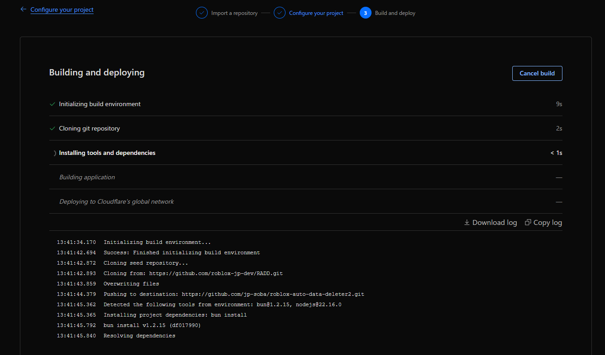
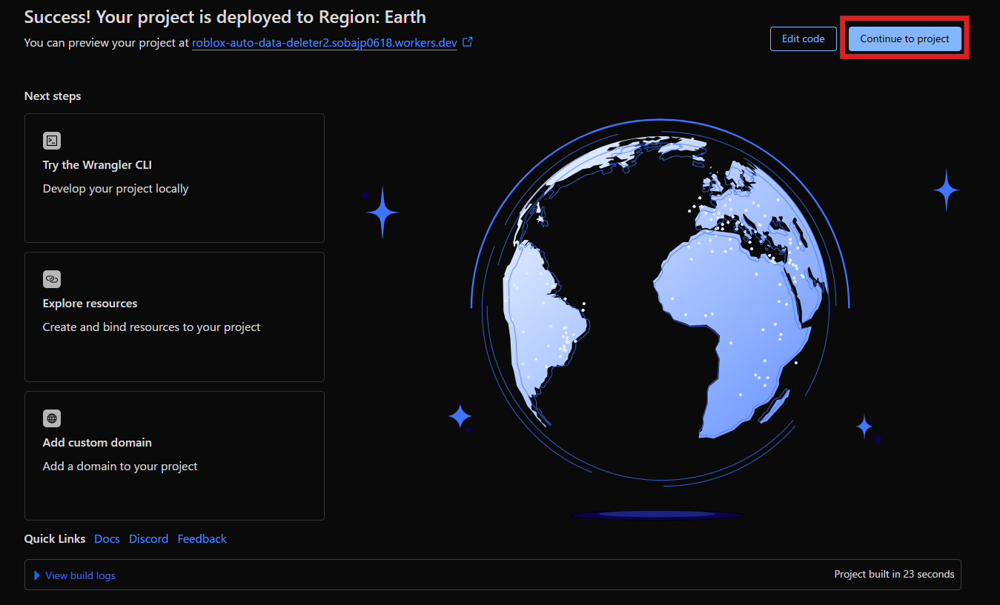
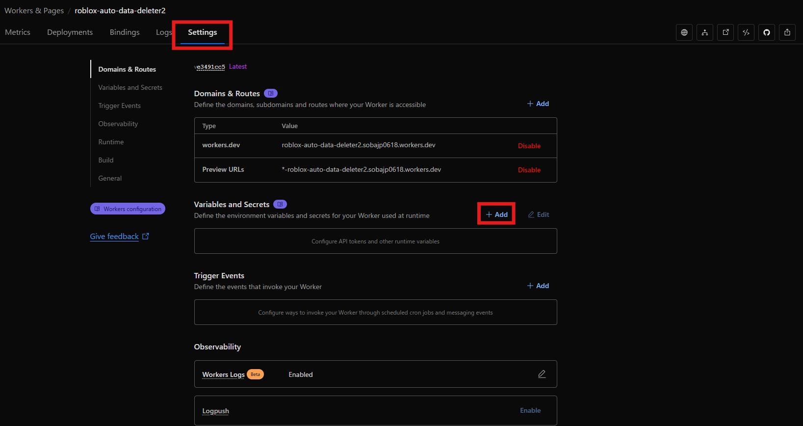

# Roblox Deletion Queue (RDQ)

A minimal, serverless API for managing Roblox user data deletion requests using Cloudflare Workers and D1!

## Other languages 
[日本語](README.ja.md)

## System Architecture


## Setup

1. Sign up with Cloudflare and Github

2. Press the button below
<a href="https://deploy.workers.cloudflare.com/?url=https%3A%2F%2Fgithub.com%2Froblox-jp-dev%2FRADD" target="_blank" rel="noopener noreferrer">
  
</a>

3. You should be taken to the Cloudflare application setup screen, select your Git account and click "Create and deploy".

4. Wait until the deployment is complete!


5. Once the deployment is complete, go to Continue to project.


6. In the Settings tab, in the Variables and Secrets section, click Add.


7. Set the API_KEY and WEBHOOK_SECRET environment variables. Set them like this. Value should be a long, secure alphanumeric value and should not be shared with anyone. Make a note of it as you will use it later.
You can also set DISCORD_WEBHOOK_URL to send notifications to Discord.


8. Copy the application domain. You will use it later!


9. Now that the setup on the application side is complete, let's set up the webhook on the Roblox side. Go to the Webhook settings page.
https://create.roblox.com/settings/webhooks

10. Please set it as shown in the image. For Webhook URL, enter https://< domain you copied earlier >/webhook. For Secret, enter the WEBHOOK_SECRET you entered earlier.


That completes the setup on the application!
Now, deletion requests received from Roblox will be stored on Cloudflare.
Using the API endpoints below, you can retrieve user IDs that have not yet been deleted, or delete data for user IDs whose data has already been deleted.

## Example of calling an API endpoint from Roblox Studio
You can call these API endpoints anywhere, for example from Python to delete using your Datastore API key.

But here we provide an example of calling it from Roblox.

1. First, get the following assets:
https://create.roblox.com/store/asset/83989452965061/RDQ-sample-script

2. Replace these two lines in the module script with the correct URL and API_KEY.


3. You can process data using the processDataDeletion function, as shown in the disabled Sample Script.

Enter the deletion function as the argument. A list of user IDs to be deleted is passed as an argument to the deletion function, so you can use this to delete the data.

If the deletion is successful, return true to consider the data deletion for the corresponding user ID successful, and the data for that user ID will also be deleted from the Cloudflare database.

As shown in the Sample Script, this can be achieved with just 15 lines of script!

### Sample Script
```lua
local DataStoreService = game:GetService("DataStoreService")
local RDQ              = require(script.Parent.RDQ)

local DATA_STORE_NAME  = "PlayerData" -- Change to the actual datastore name
local playerDataStore  = DataStoreService:GetDataStore(DATA_STORE_NAME)

RDQ.processDataDeletion(function(userIds)

	for _, userId:number in pairs(userIds) do
		local key:string = "Player_"..tostring(userId) -- Change to actual datastore key format
		playerDataStore:RemoveAsync(key)
	end
	
	return true -- If successful, return true (deletion is considered successful and sent to RDQ)
end)
```

The above script will run the deletion process every time the server is started.
Therefore, for large-scale games, if many servers are started at the same time, you may reach the request limit of Cloudflare Workers (100,000 requests/day, 1,000/day).
Therefore, in large games, you can use the following script to ensure that deletion processes are only performed once every 30 minutes by one server.

Server Version Tracker can be found here.
https://create.roblox.com/store/asset/120871081721478/Server-Version-Tracker

### Sample Script with Server Version Tracker
```lua
local DataStoreService     = game:GetService("DataStoreService")
local ServerScriptService  = game:GetService("ServerScriptService")

-- Actual module script path
local RDQ                  = require(ServerScriptService.RDQ)
local serverVersionTracker = require(ServerScriptService.ServerVersionTracker)

-- Server Version Manager is available here: https://create.roblox.com/store/asset/120871081721478/Server-Version-Tracker

-- Settings
local DATA_STORE_NAME      = "PlayerData"
local PROCESS_INTERVAL     = 30 * 60  -- 30 minutes
local playerDataStore      = DataStoreService:GetDataStore(DATA_STORE_NAME)

local function processDeletion()
	-- If it is not the management server (the oldest server of all servers), no processing will be performed.
	if not serverVersionTracker.isManagementServer() then return end
	
	local success, err = pcall(function()
		RDQ.processDataDeletion(function(userIds)
			for _, userId:number in pairs(userIds) do
				local key:string = "Player_"..tostring(userId) -- Change to actual datastore key format
				playerDataStore:RemoveAsync(key)
			end
			
			return true
		end)
	end)
	
	if not success then
		warn("Error while processing deletion:", err)
	end
end

-- Start the deletion process immediately
task.spawn(processDeletion)

-- Start the server version manager
task.spawn(function()
	while true do
		task.wait(PROCESS_INTERVAL)
		processDeletion()
	end
end)
```

## API Endpoints

### POST /webhook
Receives data deletion requests from Roblox.
- Headers: `roblox-signature` (required)
- Auth: Webhook signature verification

### GET /universes/{universeId}/users
Get pending deletion user IDs for a specific universe.
- Headers: `Authorization: Bearer {API_KEY}`
- Response: `["userId1", "userId2", ...]`

### GET /users
Get all pending deletion data grouped by universe.
- Headers: `Authorization: Bearer {API_KEY}`
- Response: `{"universeId1": ["userId1"], "universeId2": ["userId2"]}`

### DELETE /universes/{universeId}/users?userIds=user1,user2,user3
Mark deletions as completed (remove from queue).
- Headers: `Authorization: Bearer {API_KEY}`
- Query: `userIds` (comma-separated)

## Environment Variables

- `WEBHOOK_SECRET`: Secret for Roblox webhook signature verification
- `API_KEY`: API key for endpoint authentication
- `DISCORD_WEBHOOK_URL`: (Optional) Discord webhook URL for notifications
